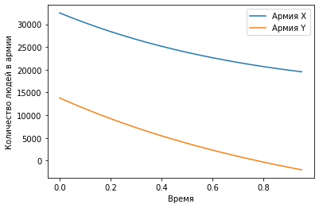
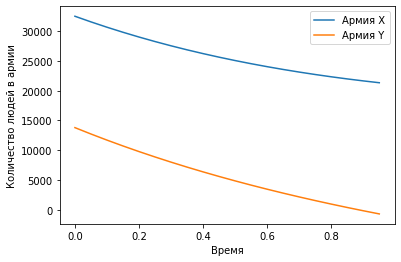

---
## Front matter
lang: en-US
title: Отсчет по лабораторной работе №3
author: |
	Valery A. Dinkiev\inst{1}
institute: |
	\inst{1}RUDN University, Moscow, Russian Federation
date: 26 Febraury 2021 Moscow, Russia

## Formatting
toc: false
slide_level: 2
theme: metropolis
header-includes: 
 - \metroset{progressbar=frametitle,sectionpage=progressbar,numbering=fraction}
 - '\makeatletter'
 - '\beamer@ignorenonframefalse'
 - '\makeatother'
aspectratio: 43
section-titles: true
---

# **Цель выполнения лабораторной работы**

## Цель

Построить упрощенную модель боевых действий с помощью Python.

# **Задача из лабораторной работы**

## Вариант 16
Между страной Х и страной У идет война. Численности состава войск исчисляются от начала войны 
и являются временными функциями $x(t)$ и $y(t)$. В начальный момент времени страна $Х$ имеет армию 
численностью 39 800 человек, а в распоряжении страны $У$ армия численностью в 21 400 человек. Для 
упрощения модели считаем, что коэффициенты $a, b, c, h$ постоянны. Также считаем $P(t)$ и $Q(t)$
непрерывными функциями.

## Задание
Постройте графики изменения численности войск армии $Х$ и армии $У$ для следующих случаев:

1. Модель боевых действий между регулярными войсками
$$\frac{\partial x}{\partial t} = -0,42x(t)-0,68y(t)+\sin (5t+1)$$
$$\frac{\partial y}{\partial t} = -0,59x(t)-0,43y(t)+\cos (5t+2)$$

2. Модель ведение боевых действий с участием регулярных войск и партизанских отрядов
$$\frac{\partial x}{\partial t} = -0,301x(t)-0,7y(t)+\sin (20t)+1$$
$$\frac{\partial y}{\partial t} = -0,502x(t)y(t)-0,4y(t)+\cos (20t)+1$$

# **Результаты выполнения лабораторной работы**

## График изменения численности армий в боевых действиях между регулярными войсками

{ #fig:001 width=70% }

## График изменения численности армий в боевых действиях с участием регулярных войск и партизанских отрядов

{ #fig:002 width=70% } 

## Вывод

Построил упрощенную модель боевых действий с помощью Python.
В боевых действиях между регулярными войсками победит армия X. Также можно видеть по графику, что армии X понадобится довольно много времени, 
армию Y. 
В боевых действиях с участием регулярных войск и партизанских отрядов также победит армия Х, но с меньшими потерями чем в случае с регулярными войсками.

## {.standout}

Спасибо за внимание!
