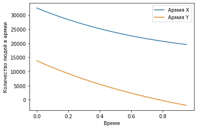
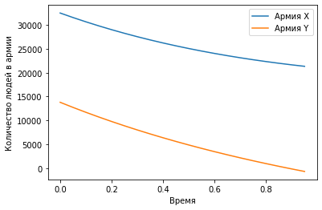

---
# Front matter
lang: ru-RU
title: "Отчет по лабораторной работе №3"
subtitle: "Модель боевых действий"
author: "Динькиев Валерий"

# Formatting
toc-title: "Содержание"
toc: true # Table of contents
toc_depth: 2
lof: true # List of figures
lot: true # List of tables
fontsize: 12pt
linestretch: 1.5
papersize: a4paper
documentclass: scrreprt
polyglossia-lang: russian
polyglossia-otherlangs: english
mainfont: PT Serif
romanfont: PT Serif
sansfont: PT Sans
monofont: PT Mono
mainfontoptions: Ligatures=MiKTeX
romanfontoptions: Ligatures=MiKTeX
sansfontoptions: Ligatures=MiKTeX,Scale=MatchLowercase
monofontoptions: Scale=MatchLowercase
indent: true
pdf-engine: xelatex
header-includes:
  - \linepenalty=10 # the penalty added to the badness of each line within a paragraph (no associated penalty node) Increasing the value makes tex try to have fewer lines in the paragraph.
  - \interlinepenalty=0 # value of the penalty (node) added after each line of a paragraph.
  - \hyphenpenalty=50 # the penalty for line breaking at an automatically inserted hyphen
  - \exhyphenpenalty=50 # the penalty for line breaking at an explicit hyphen
  - \binoppenalty=700 # the penalty for breaking a line at a binary operator
  - \relpenalty=500 # the penalty for breaking a line at a relation
  - \clubpenalty=150 # extra penalty for breaking after first line of a paragraph
  - \widowpenalty=150 # extra penalty for breaking before last line of a paragraph
  - \displaywidowpenalty=50 # extra penalty for breaking before last line before a display math
  - \brokenpenalty=100 # extra penalty for page breaking after a hyphenated line
  - \predisplaypenalty=10000 # penalty for breaking before a display
  - \postdisplaypenalty=0 # penalty for breaking after a display
  - \floatingpenalty = 20000 # penalty for splitting an insertion (can only be split footnote in standard LaTeX)
  - \raggedbottom # or \flushbottom
  - \usepackage{float} # keep figures where there are in the text
  - \floatplacement{figure}{H} # keep figures where there are in the text
---

# Цель работы

Построить упрощенную модель боевых действий с помощью Python.

# Задание

**Вариант 16**
Между страной $Х$ и страной $У$ идет война. Численности состава войск исчисляются от начала войны 
и являются временными функциями $x(t)$ и $y(t)$. В начальный момент времени страна $Х$ имеет армию 
численностью 39 800 человек, а в распоряжении страны $У$ армия численностью в 21 400 человек. Для 
упрощения модели считаем, что коэффициенты $a, b, c, h$ постоянны. Также считаем $P(t)$ и $Q(t)$
непрерывными функциями.

Постройте графики изменения численности войск армии $Х$ и армии $У$ для следующих случаев:

1. Модель боевых действий между регулярными войсками
$$\frac{\partial x}{\partial t} = -0,42x(t)-0,68y(t)+\sin (5t+1)$$
$$\frac{\partial y}{\partial t} = -0,59x(t)-0,43y(t)+\cos (5t+2)$$

2. Модель ведение боевых действий с участием регулярных войск и партизанских отрядов
$$\frac{\partial x}{\partial t} = -0,301x(t)-0,7y(t)+\sin (20t)+1$$
$$\frac{\partial y}{\partial t} = -0,502x(t)y(t)-0,4y(t)+\cos (20t)+1$$

# Выполнение лабораторной работы
**1. Модель боевых действий между регулярными войсками.**

1.1. Изучил начальные условия. Коэффициент смертности, не связанный с боевыми действиями, у первой
армии 0,42, а у второй -- 0,43. Коэффициент эффективности первой и второй армии 0,59 и 
0,68 соответственно.  Функция, описывающая подход подкрепление первой армии, $P(t) = \sin (5t+1)$, 
подкрепление второй армии описывается функцией $Q(t) = \cos (5t+2)$. 
$x_{0} = 39800$ -- людей 1-ой армии, 
$y_{0} = 21400$ -- людей 2-ой армии.

1.2. Построим численное решение для начальных условий:
```
x_0 = 39800
y_0 = 21400
a_1 = 0.42
b_1 = 0.68
c_1 = 0.59
h_1 = 0.43
def P_1(t):
    p_1 = np.sin(5t + 1)
    return p_1

def Q_1(t):
    q_1 = np.cos(5t + 2)
    return q_1
```

1.3. Для времени задал следующие условия: 
$t_{0} = 0$ -- начальный момент времени, 
$t_{max} = 1$ --предельный момент времени, 
$dt = 0,05$ -- шаг изменения времени.

1.4. Добавил в программу условия, описывающие время:
```
t_0 = 0
t_max = 1
dt = 0.05
t = np.arange(t_0, t_max, dt)
```

1.5. Запрограммировал заданную систему дифференциальных уравнений, описывающих изменение количества людей в 
армии:
```
def S_1(f, t):
    s_1 = -a_1*f[0] - b_1*f[1] + P_1(t)
    s_2 = -c_1*f[0] - h_1*f[1] + Q_1(t)
    return s_1, s_2
```

1.6. Создал вектор начальной численности армий:
```
v = np.array([x0, y0])
```

1.7. Запрограммировал решение системы уравнений:
```
f_1 = odeint(S1, v, t)
```

1.8. Построил график изменения численности армий:
```
plt.plot(t, f1)
```

2.1. Изучил начальные условия. Коэффициент смертности, не связанный с боевыми действиями, у первой
армии 0,301, а у второй -- 0,4. Коэффициент эффективности первой и второй армии 0,502 и 
0,7 соответственно.  Функция, описывающая подход подкрепление первой армии, $P(t) = \sin (20t)+1$, 
подкрепление второй армии описывается функцией $Q(t) = \cos (20t)+1$. 
$x_{0} = 39800$ -- людей 1-ой армии, 
$y_{0} = 21400$ -- людей 2-ой армии.

2.2. Построим численное решение для начальных условий:
```
x_0 = 39800
y_0 = 21400
a_2 = 0.301
b_2 = 0.7
c_2 = 0.502
h_2 = 0.4
def P_2(t):
    p_2 = np.sin(20t) + 1
    return p_2

def Q_2(t):
    q_2 = np.cos(20t) + 1
    return q_2
```

2.3. Для времени задал следующие условия: 
$t_{0} = 0$ -- начальный момент времени, 
$t_{max} = 1$ --предельный момент времени, 
$dt = 0,05$ -- шаг изменения времени.

2.4. Добавил в программу условия, описывающие время:
```
t_0 = 0
t_max = 1
dt = 0.05
t = np.arange(t_0, t_max, dt)
```

2.5. Функция заданной системы дифференциальных уравнений, которое описывает изменение количества людей в 
армии:
```
def S_2(f, t):
    s_1 = -a_2*f[0] - b_2*f[1] + P_2(t)
    s_2 = -c_2*f[0] - h_2*f[1] + Q_2(t)
    return s_1, s_2
```

2.6. Запрограммировал решение системы уравнений:
```
f_2 = odeint(S_2, v, t)
```

2.7. Построил график изменения численности армий:
```
plt.plot(t, f_2)
```

**3. Программа на Python**
```
import math
import numpy as np
from scipy.integrate import odeint
import matplotlib.pyplot as plt
x_0 = 39800
y_0 = 21400

a_1 = 0.42
b_1 = 0.68
c_1 = 0.59
h_1 = 0.43

a_2 = 0.301
b_2 = 0.7
c_2 = 0.502
h_2 = 0.4

t0 = 0
tmax = 1
dt = 0.05
t = np.arange(t0, tmax, dt)

def P_1(t):
    p_1 = np.sin(5*t + 1)
    return p_1

def Q_1(t):
    q_1 = np.cos(5*t + 2)
    return q_1

def P_2(t):
    p_2 = np.sin(20*t) + 1
    return p_2

def Q_2(t):
    q_2 = np.cos(20*t) + 1
    return q_2

def S_1(f, t):
    s_1 = -a_1*f[0] - b_1*f[1] + P_1(t)
    s_2 = -c_1*f[0] - h_1*f[1] + Q_1(t)
    return s_1, s_2

def S_2(f, t):
    s_1 = -a_2*f[0] - b_2*f[1] + P_2(t)
    s_2 = -c_2*f[0] - h_2*f[1] + Q_2(t)
    return s_1, s_2

v = np.array([x0, y0])
f_1 = odeint(S_1, v, t)
f_2 = odeint(S_2, v, t)

plt.plot(t, f_2)
plt.ylabel('Количество людей в армии')
plt.xlabel('Время')
plt.legend(['Армия X', 'Армия Y'])

plt.plot(t, f_1)
plt.ylabel('Количество людей в армии')
plt.xlabel('Время')
plt.legend(['Армия X', 'Армия Y'])
```
3.1. Получил графики изменения численностей армий (см. рис. -@fig:001 и -@fig:002)

{ #fig:001 width=70% }

{ #fig:002 width=70% }


# Выводы

Построил упрощенную модель боевых действий с помощью Python.
В боевых действиях между регулярными войсками победит армия X. Также можно видеть по графику, что армии X понадобится довольно много времени, 
армию Y. 
В боевых действиях с участием регулярных войск и партизанских отрядов также победит армия Х, но с меньшими потерями чем в случае с регулярными войсками.