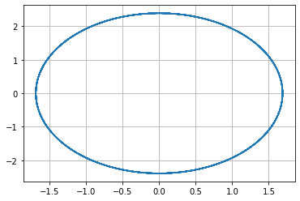
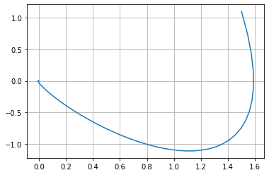
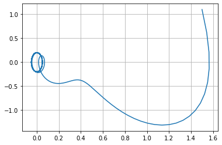

---
## Front matter
lang: en-US
title: Отчет по лабораторной работе №4
author: |
	Valery A. Dinkiev\inst{1}
institute: |
	\inst{1}RUDN University, Moscow, Russian Federation
date: 06 March 2021 Moscow, Russia

## Formatting
toc: false
slide_level: 2
theme: metropolis
header-includes: 
 - \metroset{progressbar=frametitle,sectionpage=progressbar,numbering=fraction}
 - '\makeatletter'
 - '\beamer@ignorenonframefalse'
 - '\makeatother'
aspectratio: 43
section-titles: true
---

# **Цель выполнения лабораторной работы**

## Цель

Построить модель гармонических колебаний с помощью Python.

# **Задача из лабораторной работы**

1. Построить решение уравнения гармонического осциллятора без затухания 

2. Записать уравнение свободных колебаний гармонического осциллятора с затуханием, построить его решение. 
   Построить фазовый портрет гармонических колебаний с затуханием.

3. Записать уравнение колебаний гармонического осциллятора, если на систему действует внешняя сила, построить его решение. 
   Построить фазовый портрет колебаний с действием внешней силы

## Задание

**Вариант 16**

Постройте фазовый портрет гармонического осциллятора и решение уравнения гармонического осциллятора для следующих случаев:

1. Колебания гармонического осциллятора без затуханий и без действий внешней силы 
   $\ddot {x} + 2x = 0$

2. Колебания гармонического осциллятора c затуханием и без действий внешней силы 
   $\ddot {x} + 3 \dot {x} + 3x = 0$

3. Колебания гармонического осциллятора c затуханием и под действием внешней силы 
   $\ddot {x} + 4 \dot {x} + 4x = \sin (4t)$

На интервале $t \in [0; 44]$ (шаг 0,05) с начальными условиями $x_0 = 1,5, y_0 = 1,1$

# **Результаты выполнения лабораторной работы**

## Колебания гармонического осциллятора без затуханий и без действий внешней силы

{ #fig:001 width=70% }

## Колебания гармонического осциллятора c затуханием и без действий внешней силы

{ #fig:002 width=70% } 

## Колебания гармонического осциллятора c затуханием и под действием внешней силы

{ #fig:003 width=70% } 

## Вывод

Построил модель гармонических колебаний с помощью Python.

## {.standout}

Спасибо за внимание!
