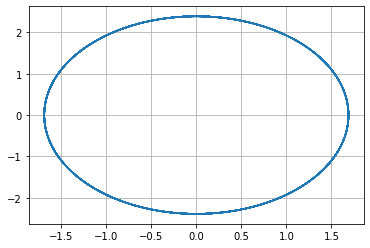
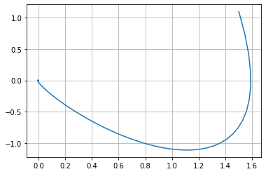
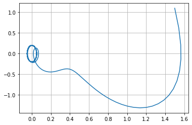

---
# Front matter
lang: ru-RU
title: "Отсчет по лабораторной работе №4"
subtitle: "Модель гармонических колебаний"
author: "Динькиев Валерий"

# Formatting
toc-title: "Содержание"
toc: true # Table of contents
toc_depth: 2
lof: true # List of figures
lot: true # List of tables
fontsize: 12pt
linestretch: 1.5
papersize: a4paper
documentclass: scrreprt
polyglossia-lang: russian
polyglossia-otherlangs: english
mainfont: PT Serif
romanfont: PT Serif
sansfont: PT Sans
monofont: PT Mono
mainfontoptions: Ligatures=MiKTeX
romanfontoptions: Ligatures=MiKTeX
sansfontoptions: Ligatures=MiKTeX,Scale=MatchLowercase
monofontoptions: Scale=MatchLowercase
indent: true
pdf-engine: xelatex
header-includes:
  - \linepenalty=10 # the penalty added to the badness of each line within a paragraph (no associated penalty node) Increasing the value makes tex try to have fewer lines in the paragraph.
  - \interlinepenalty=0 # value of the penalty (node) added after each line of a paragraph.
  - \hyphenpenalty=50 # the penalty for line breaking at an automatically inserted hyphen
  - \exhyphenpenalty=50 # the penalty for line breaking at an explicit hyphen
  - \binoppenalty=700 # the penalty for breaking a line at a binary operator
  - \relpenalty=500 # the penalty for breaking a line at a relation
  - \clubpenalty=150 # extra penalty for breaking after first line of a paragraph
  - \widowpenalty=150 # extra penalty for breaking before last line of a paragraph
  - \displaywidowpenalty=50 # extra penalty for breaking before last line before a display math
  - \brokenpenalty=100 # extra penalty for page breaking after a hyphenated line
  - \predisplaypenalty=10000 # penalty for breaking before a display
  - \postdisplaypenalty=0 # penalty for breaking after a display
  - \floatingpenalty = 20000 # penalty for splitting an insertion (can only be split footnote in standard LaTeX)
  - \raggedbottom # or \flushbottom
  - \usepackage{float} # keep figures where there are in the text
  - \floatplacement{figure}{H} # keep figures where there are in the text
---

# Цель работы

Построить модель гармонических колебаний с помощью Python.

# Задание

**Вариант 16**

Постройте фазовый портрет гармонического осциллятора и решение уравнения гармонического осциллятора для следующих случаев:

1. Колебания гармонического осциллятора без затуханий и без действий внешней силы 
   $\ddot {x} + 2x = 0$

2. Колебания гармонического осциллятора c затуханием и без действий внешней силы 
   $\ddot {x} + 3 \dot {x} + 3x = 0$

3. Колебания гармонического осциллятора c затуханием и под действием внешней силы 
   $\ddot {x} + 4 \dot {x} + 4x = \sin (4t)$

На интервале $t \in [0; 44]$ (шаг 0,05) с начальными условиями $x_0 = 1,5, y_0 = 1,1$

# Выполнение лабораторной работы
**1. Колебания без затуханий и без действий внешней силы**

1.1. Уравнение свободных колебаний гармонического осциллятора имеет следующий вид:
     $$ \ddot {x} + 2 \gamma \dot {x} + \omega _0^2x = f(t) $$ 

Начальные условия:

 Потери энергии отсутсвуют в системе $\gamma = 0$

 Собственная частота колебаний $\omega = 2$. 

 $x_{0} = 1,5, y_{0} = 1,1$.

 Правая часть уравнения $f(t) = 0$.

1.2. Оформил начальные условия на Python и записал в виде функции решение правой части уравнения:

```
x_0 = np.array([1.5, 1.1])
w_1 = 2 #частота колебаний
g_1 = 0.0 #затухание

def F_1(t):
    f = 0
    return f
```

1.3. Записал условия времени в программу на Python. 

Решение ищем на интервале $t \in [0; 44]$ (шаг 0,05):

  $t_{0} = 0$ -- начальный момент времени, 

  $t_{max} = 44$ -- предельный момент времени,
 
  $dt = 0,05$ -- шаг изменения времени.

  Код на Python:

```
t_0 = 0
t_max = 44
dt = 0.05
t = np.arange(t_0, t_max, dt)
```

1.4. Представил заданное уравнение второго порядка в виде системы двух уравнений первого порядка и записал в виде функции на Python: 

```
def Y_1(x, t):
    dx1_1 = x[1]
    dx1_2 = - w_1*x[0] - g_1*x[1] - F_1(t)
    return dx1_1, dx1_2
```

1.5. Запрограммировал решение системы уравнений:

```
x_1 = odeint(Y_1, x_0, t)
```

1.6. Переписал отдельно $x$ в $y_1$, а $\dot {x}$ в $y_2$:

```
y1_1 = x_1[:, 0]
y1_2 = x_1[:, 1]
```

1.7. Описал построение фазового портрета гармонических колебаний:

```
plt.plot(y1_1, y1_2)
```

**2. Колебания с затуханием и без действий внешней силы**

2.1. Уравнение свободных колебаний гармонического осциллятора имеет следующий вид:
     $$ \ddot {x} + 2 \gamma \dot {x} + \omega _0^2x = f(t) $$ 

Начальные условия:

 Потери энергии в системе $\gamma = 3$

 Собственная частота колебаний $\omega = 3$. 

 $x_{0} = 1,5, y_{0} = 1,1$.

 Правая часть уравнения $f(t) = 0$.

2.2. Оформил начальные условия на Python и записал в виде функции решение правой части уравнения:

```
x_0 = np.array([1.5, 1.1])
w_2 = 3 #частота колебаний
g_2 = 3 #затухание

def F_2(t):
    f = 0
    return f
```

2.3. Условия интервала мы уже задали в начале.

2.4. Представил заданное уравнение второго порядка в виде системы двух уравнений первого порядка и записал в виде функции на Python: 

```
def Y_2(x, t):
    dx2_1 = x[1]
    dx2_2 = - w_2*x[0] - g_2*x[1] - F_2(t)
    return dx2_1, dx2_2
```

2.5. Запрограммировал решение системы уравнений:

```
x_2 = odeint(Y_2, x_0, t)
```

2.6. Переписал отдельно $x$ в $y_1$, а $\dot {x}$ в $y_2$:

```
y2_1 = x_2[:, 0]
y2_2 = x_2[:, 1]
```

2.7. Описал построение фазового портрета гармонических колебаний с затуханием:

```
plt.plot(y2_1, y2_2)
```

**3. Колебания с затуханием и под действием внешней силы**

3.1. Уравнение свободных колебаний гармонического осциллятора имеет следующий вид:
     $$ \ddot {x} + 2 \gamma \dot {x} + \omega _0^2x = f(t) $$ 

Начальные условия:

 Потери энергии в системе $\gamma = 4$

 Собственная частота колебаний $\omega = 4$. 

 $x_{0} = 1,5, y_{0} = 1,1$.

 Правая часть уравнения $f(t) = \sin (4t)$.

3.2. Оформил начальные условия на Python и записал в виде функции решение правой части уравнения:

```
x_0 = np.array([1.5, 1.1])
w_3 = 4 #частота колебаний
g_3 = 4 #затухание

def F_3(t):
    f = math.sin(4*t)
    return f
```

3.3. Условия интервала мы уже задали в начале.

3.4. Представил заданное уравнение второго порядка в виде системы двух уравнений первого порядка и записал в виде функции на Python: 

```
def Y_3(x, t):
    dx3_1 = x[1]
    dx3_2 = - w_3*x[0] - g_3*x[1] - F_3(t)
    return dx3_1, dx3_2
```

3.5. Запрограммировал решение системы уравнений:

```
x_3 = odeint(Y_3, x_0, t)
```

3.6. Переписал отдельно $x$ в $y_1$, а $\dot {x}$ в $y_2$:

```
y3_1 = x_3[:, 0]
y3_2 = x_3[:, 1]
```

3.7. Описал построение фазового портрета гармонических колебаний с затуханием и под действием внешней силы:

```
plt.plot(y3_1, y3_x2)
```

**4. Код на Python**

```
import math
import numpy as np
from scipy.integrate import odeint
import matplotlib.pyplot as plt

# начальные условия 
x_0 = np.array([1.5, 1.1]) # вектор начальных условий
w_1 = 2 # частота колебаний
g_1 = 0.0 # затухание

# интервал
t_0 = 0
t_max = 44
dt = 0.05 # шаг изменения времени

t = np.arange(t_0, t_max, dt)

# функция для вычисления правой части уравнения
def F_1(t):
    f = 0
    return f

# заданное уравнение в виде системы двух уравнений первого порядка
def Y_1(x, t):
    dx1_1 = x[1]
    dx1_2 = - w_1*x[0] - g_1*x[1] - F_1(t)
    return dx1_1, dx1_2

# решение системы уравнений
x_1 = odeint(Y_1, x_0, t)

y1_1 = x_1[:, 0]
y1_2 = x_1[:, 1]

# построение фазового портрета гармонических колебаний 
plt.plot(y1_1, y1_2)
plt.grid(axis = 'both')

w_2 = 3.0 # частота колебаний
g_2 = 3.0 # затухание

# функция для вычисления правой части уравнения
def F_2(t):
    f = 0
    return f

# заданное уравнение в виде системы двух уравнений первого порядка
def Y_2(x, t):
    dx2_1 = x[1]
    dx2_2 = - w_2*x[0] - g_2*x[1] - F_2(t)
    return dx2_1, dx2_2

# решение системы уравнений
x_2 = odeint(Y_2, x_0, t)
y2_1 = x_2[:, 0]
y2_2 = x_2[:, 1]

# построение фазового портрета гармонических колебаний с затуханием
plt.plot(y2_1, y2_2)
plt.grid(axis = 'both')

w_3 = 4.0 # частота колебаний
g_3 = 4.0 # затухание

# функция для вычисления правой части уравнения
def F_3(t):
    f = math.sin(4*t)
    return f

# заданное уравнение в виде системы двух уравнений первого порядка
def Y_3(x, t):
    dx3_1 = x[1]
    dx3_2 = - w_3*x[0] - g_3*x[1] - F_3(t)
    return dx3_1, dx3_2

# решение системы уравнений
x_3 = odeint(Y_3, x_0, t)
y3_1 = x_3[:, 0]
y3_2 = x_3[:, 1]

# построение фазового портрета гармонических колебаний с затуханием и под действием внешней силы
plt.plot(y3_1, y3_2)
plt.grid(axis = 'both')
```

4.1. Построил фазовый портрет гармонического осциллятора (см. рис. -@fig:001, -@fig:002 и -@fig:003):


{ #fig:001 width=70% }

{ #fig:002 width=70% }

{ #fig:003 width=70% }

# Выводы

Построил модель гармонических колебаний с помощью Python.

# Ответы на вопросы к лабораторной работе

*1. Запишите простейшую модель гармонических колебаний*

$x = x_m cos (\omega t + \varphi _0)$. 

*2. Дайте определение осциллятора*

Осциллятор — система, совершающая колебания, то есть показатели которой периодически повторяются во времени.

*3. Запишите модель математического маятника*

$$ \ddot {x} + 2 \gamma \dot {x} + \omega _0^2x = f(t) $$ 

*4. Запишите алгоритм перехода от дифференциального уравнения второго порядка к двум дифференциальным уравнениям первого порядка*

4.1. Дифф. уравнение 2-го порядка $$ \ddot {x} + \omega _0^2x = f(t) $$

4.2. Сделаем замену.
$$ y = \dot{x} $$

4.3 Получаем систему уравнений:
  \begin{equation*} 
    \begin{cases}
      y = \dot{x}
      \\ 
      \dot{y} = - \omega _0^2x
    \end{cases}
  \end{equation*} 

*5. Что такое фазовый портрет и фазовая траектория?*

Фазовый портрет — общая картина поведения системы, возникающая, 
если множество различных решений (соответствующих различным начальным условиям) изобразить на одной фазовой плоскости.

Фазовая траектория — гладкая кривая в фазовой плоскости, отвечающая решению уравнения движения как функции времени.